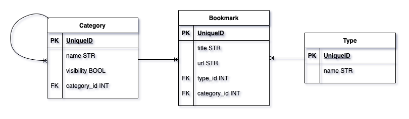

# Bookmarks app

This project present a Bookmark app done from scratch implementing AJAX (Asynchronous JavaScript and XML) and graphics to display the data information.

## Table of Contents

  * [Ruby and Rails Version](#ruby-and-rails-version)
  * [Ruby Gems](#ruby-gems)
  * [1. Model diagram](#1-model-diagram)
    + [1.1. Defining the model](#11-defining-the-model)
  * [2. Category and Type CRUD](#2-category-and-type-crud)
  * [3. Bookmark AJAX CRUD](#3-bookmark-ajax-crud)
    + [3.1. The Routes](#31-the-routes)
    + [3.2. Index](#32-index)
    + [3.3. New](#33-new)
    + [3.4. Show](#34-show)
    + [3.5. Create](#35-create)
    + [3.6. Edit](#36-edit)
    + [3.7. Update](#37-update)
    + [3.8. Destroy](#38-destroy)
  * [4. Category Endpoint](#4-category-endpoint)
  * [5. Populating](#5-populating)
  * [6. Bookmark Graphic](#6-bookmark-graphic)

## Ruby and Rails Version

* ruby '2.6.1'
* gem 'rails', '~> 5.2.6'

## Ruby Gems

```ruby
gem "bootstrap", "~> 5.1"
gem "jquery-rails", "~> 4.4"
gem "faker", "~> 2.19"
gem "chartkick", "~> 4.1"
gem "groupdate", "~> 5.2"
gem "font-awesome-rails", "~> 4.7"
``` 

## 1. Model diagram 

<p align="center"></p>

The image shows that Category and Type share a has many association with Bookmarks. At the same time, Category works as reflexive association that will contain new categories inside itself, called subcategories.

### 1.1. Defining the model

The models are implemented as it is describe next:

```console
rails g model Type name
rails g model Category name visibility:boolean category:references
rails g model Bookmark title url type:references category:references
```

The controllers are also implemented as:

```console
rails g controller Types index
rails g controller Categories index
rails g controller Bookmarks index
```

The association is established in the model as it follows:

```ruby
class Type < ApplicationRecord
    has_many :bookmarks, dependent: :destroy
end

class Category < ApplicationRecord  
    has_many :sub_categories, class_name: "Category", foreign_key: "category_id", dependent: :destroy			
    belongs_to :main_category, class_name: "Category", foreign_key: "category_id", optional: true	
    has_many :bookmarks, dependent: :destroy
end

class Bookmark < ApplicationRecord
    belongs_to :type
    belongs_to :category
end
```

## 2. Category and Type CRUD

The CRUD of Category and Type are made following the MVC ((Model - View - Controller) design pattern.

## 3. Bookmark AJAX CRUD

### 3.1. The Routes 

The routes are defined as:

```ruby
# routes.rb

Rails.application.routes.draw do
  root 'bookmarks#index'
  resources :bookmarks
  resources :types
  resources :categories
end
```

### 3.2. Index 

In the controller the display of all the bookmarks is defined in reverse order by the last one created:

```ruby
# bookmarks_controller.rb

def index
    @bookmarks = Bookmark.order(:created_at).reverse_order
end
```

The partial form is made through the AJAX request **```"remote: true"```** as:

```ruby
<%= form_with(model: @bookmark, remote: true) do |form| %>
```

Then, the form is called by the **```id="form_new"```** from the index.

```html
# bookmarks/index.html.rb

<div id="form_new" class="container"></div>
<div id="show_bookmark" class="container"></div>
<div id="new_button" class="container">
  <%= render 'new_button' %>
</div>

<table class="table table-hover">
  <thead>
    <tr>
      <th scope="col">Id</th>
      <th scope="col">Title</th>
      <th scope="col">Link</th>
      <th scope="col">Category</th>
      <th scope="col">Type</th>
    </tr>
  </thead>
  <tbody id="bookmarks">
    <% @bookmarks.each do |bookmark| %>
      <%= render 'bookmark', bookmark: bookmark %>
    <% end %>
  </tbody>
</table>
```

### 3.3. New

In the controller:

```ruby
# bookmarks_controller.rb

def new
    @bookmark = Bookmark.new
    @type = Type.new
    @category = Category.new
    @types = Type.all
    @categories = Category.all
end
```

In the template js:

```javascript
// bookmarks/new.js.erb

$('#form_new').append('<%= escape_javascript render('bookmarks/form') %>');
$('#new_button').html(' ');
```

### 3.4. Show 

In the controller:

```ruby
# bookmarks_controller.rb

before_action :set_bookmark, only: [:show]

def show   
end
```

In the template js:

```javascript
// bookmarks/show.js.erb

$('#show_bookmark').html('<%= j render('bookmarks/show') %>')
```
### 3.5. Create 

In the controller:

```ruby
# bookmarks_controller.rb

def create
    @bookmark = Bookmark.new(bookmark_params)
    sleep 2
    respond_to do |format|
        if @bookmark.save!
            format.js { render nothing: true }
            flash.now[:notice] = 'Bookmark created!'
        else
            flash.now[:notice] = 'Bookmark could not be created'
        end
    end
end
```

In the template js:

```javascript
// bookmarks/create.js.erb

$('#bookmarks').prepend('<%= j render('bookmarks/bookmark', bookmark: @bookmark)%>');
$('#form_new').html(' ');
$('#new_button').append('<%= escape_javascript render('bookmarks/new_button') %>')
$('#notice_bookmark').append('<%= j render('bookmarks/notice') %>')
```
### 3.6. Edit 

In the controller:

```ruby
# bookmarks_controller.rb
before_action :set_bookmark, only: [:show, :edit]

def edit
    @types = Type.all
    @categories = Category.all
end
```

In the template js:

```javascript
// bookmarks/edit.js.erb

$('#form_new').html('<%= escape_javascript render('bookmarks/form') %>')
```
### 3.7. Update 

In the controller:

```ruby
# bookmarks_controller.rb

before_action :set_bookmark, only: [:show, :edit, :update]

def update
    respond_to do |format|
        if @bookmark.update!(bookmark_params)
            format.js { render layout: false }
            flash.now[:notice] = 'Bookmark updated!'
        else
            flash.now[:notice] = 'Bookmark could not be updated'
        end
    end
end
```

In the template js:

```javascript
// bookmarks/update.js.erb

$('#form_new').html(' ');
$('#bookmark-<% @bookmark.id %>').replaceWith('<%= j render('bookmarks/bookmark', bookmark: @bookmark) %>');
$('#notice_bookmark').append('<%= j render('bookmarks/notice') %>');
```
### 3.8. Destroy 

In the controller:

```ruby
# bookmarks_controller.rb

before_action :set_bookmark, only: [:show, :edit, :update, :destroy]

def destroy
    respond_to do |format|
        if @bookmark.destroy!
            format.js { render nothing: false }
            flash.now[:notice] = 'Bookmark deleted!'
        else
            flash.now[:notice] = 'Bookmark could not be deleted'
        end
    end
end   
```

In the template js:

```javascript
// bookmarks/destroy.js.erb

$('#bookmark-<% @bookmark.id %>').remove().empty();
$('#notice_bookmark').append('<%= j render('bookmarks/notice') %>');
```

## 4. Category Endpoint

An endpoint is made to return a JSON with the category data that includes his subcategories and the bookmarks to which is associated. The route is defined as it follows:

```ruby
# routes.rb

get '/endpoint/:id', to: 'categories#endpoint', as: 'endpoint'
```

From the controller, the method endpoint is created including the sub categories and bookmarks of the category as:

```ruby
# categories_controller.rb

def endpoint
    @category = Category.find(params[:id])
    render json: @category.to_json(include: [:sub_categories, :bookmarks])
end
```

## 5. Populating

With the help of the Faker gem, the database is populated in the ```seed.rb``` file.

## 6. Bookmark Graphic

A new controller Home is made to display the graphic:

```console
rails g controller Home index
```

In this controller, the bookmarks are group by type:

```ruby
class HomeController < ApplicationController
  def index
    @bookmark_by_types = Bookmark.joins(:type).group(:name).count
  end
end
```

In the view, the graphic is called as:

```html
# home/index.html.erb

<div class="container my-3 pie-chart">
    <%= pie_chart @bookmark_by_types, donut: true %>  
</div>
```

Finally, the graphic shows the type count of the bookmarks as it follows:

<p align="center"></p>
